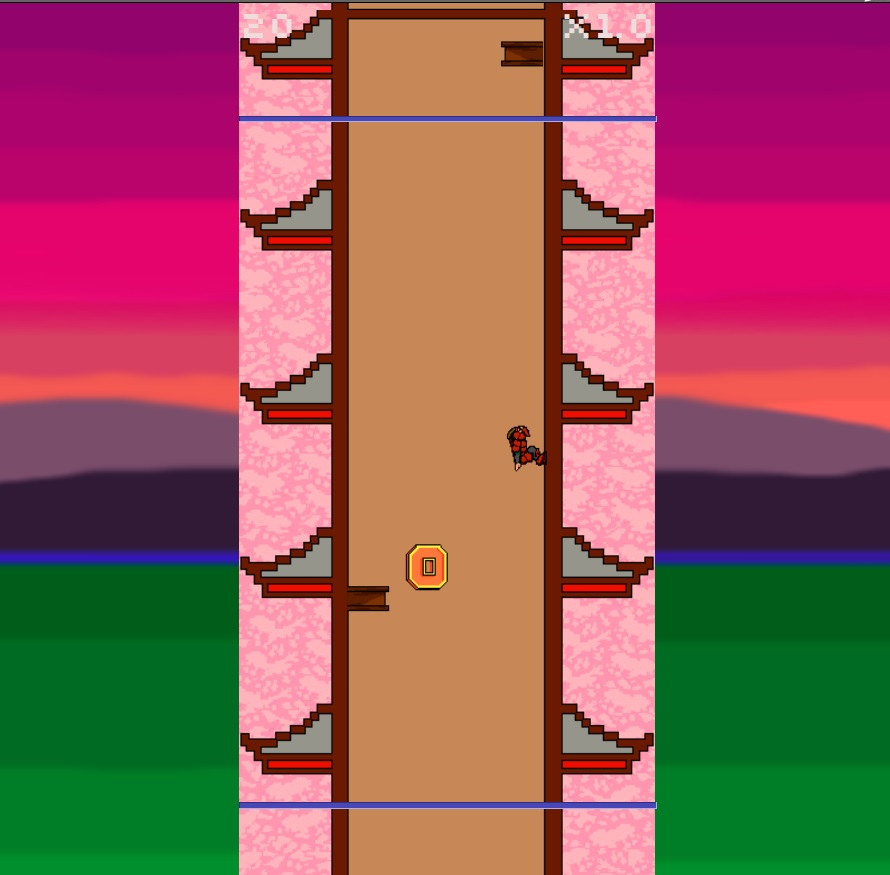
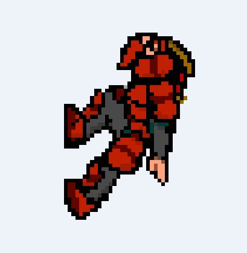
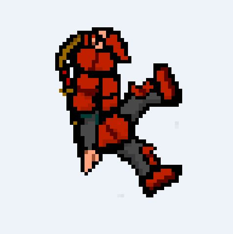

#[Shoten Samurai - GDD](shotenSamurai.html)
- [Shoten Samurai - GDD](#shoten-samurai---gdd)
    - [Introduction](#introduction)
        - [Game concept](#game-concept)
        - [Distinctive features](#Distinctive-features)
        - [Gender](#gender)
        - [Objective and Target audience](#Objective-and-target-audience)
        - [Gameplay](#gameplay)
        - [Visual style](#visual-style)
        - [Scope](#scope)
    - [Game mechanics](#game-mechanics)
        - [Gameplay](#gameplay-1)
            - [Levels](#levels)
            - [Difficulty](#difficulty)
            - [Score](#Score)
        - [Game flow](#game-flow)
        - [Characters and objects](#characters-and-objects)
            - [Samurai](#samurai)
            - [The Tower](#the-tower)
            - [Stage objects](#scenario-objects)
        - [Movements](#movements)
        - [Interactions](#interactions)
    - [Interface](#interface)
        - [Flowchart](#flowchart)
        - [Welcome screen](#welcome-screen)
        - [Main Menu](#main-menu)
        - [Credits](#credits)
        - [Best scores](#best-scores)
        - [Configuration](#configuration)
        - [Tutorial screen](#screen-tutorial)
        - [Main screen](#main-screen)
        - [Game Over](#game-over)
    - [Art](#art)
        - [2D Art](#art-2d)
        - [2D animations](#animations-2d)
        - [Sound](#sound)
        
## Heimdall Games
- Javier Martínez Pablo - Game Designer
- Iago Calvo Lista - Developer
- Iago Cruz García - Developer
- Germán Matilla Jiménez - 2D Artist
- Ángel Cabanilles Gomar - 2D Artist, 2D Animator

## Introduction
This is the game design document of *Shoten Samurai*, designed for web browsers, both for computers and mobile devices. This game will be designed exclusively with W3C tools such as HTML, CSS and JavaScript.
The key concepts of game development will be detailed including mechanics, art, objectives, controls, etc.
### Game concept
*Shoten Samurai* is a game in which we control a samurai who decides to climb a strange tower that is collapsing, dodging or destroying falling objects.
### Distinctive features
* A simple game: a single action button to jump.
* An infinite tower, where you will have to endure as much as possible by scaling it.
* Constant challenge, testing your skills, increasing the difficulty as you progress.
* Oriental theme with hints of humor.
### Gender
The idea of ​​*Shoten Samurai* is born from ideas such as *Lumberjack*, *Geometry Dash* and *Fruit Ninja*, simple and challenging ideas, therefore the game is a mixture of several genres such as:
* **Endless Running**: The tower is infinite, climbing as far as we stand.
* **Arcade**: Increasing difficulty, increasing the speed of objects.
### Purpose and Target Audience
It is a game that is intended for all audiences, both for people with a lot of free time who are looking for a challenge that entertains them, as well as for people with little free time and who are looking for short games to consume the daily dead times.
We estimate that the game will have a PEGI+12, for including bad words.
### Gameplay
The game will consist of a single infinite level whose background and objects on the screen will change according to the difficulty. The character must jump between the two walls of the tower, destroying the breakable objects to get more punctuation and avoiding those obstacles that will cause a terrible and painful death.
* **Mobility**: Character that ascends through a tower, jumping from wall to wall at an angle of 45 degrees.
* **Obstacles and objects**: On the walls there will be fixed objects that will have to be avoided and objects, some breakable (bamboo, cloth, wood ...) and other indestructible objects (different rock sprites) will fall through the center.
### Visual style
It presents an oriental aesthetic with touches of pixel art, the game will be a claim for fans of this visual style and the nostalgic of the 16 bits.
The colors used in the game are based on the representative standard palette of feudal oriental culture: reddish, golden, brown and even pink tones.
### Reach
The objective of this project is to present a game with simple mechanics, which is easy to understand and very entertaining.
In the future, improvements to the games or a personalization section may be included.
## Game mechanics
This section will explain in detail everything related to the mechanics of the Shoten Samurai game.
In a concise and clear way all the important aspects will be shown as far as the items are concerned; indicating how the levels will be, how the character will advance, what objects will appear on the screen and others.
### Gameplay
The *Shoten Samurai* controls will be simple and straightforward: a single click on the screen or on the *space* button on the keyboard for the character to jump to the other wall. The player must calculate when he must jump to be able to dodge the objects on the sides correctly, break the ones that fall through the center or not to stay long on the same wall and thus lose the game. All jumps will be made at a 45 degree angle to the opposite wall.

During the game, two horizontal blue bars will be observed, one at the top and one at the bottom of the tower, to show the player the limits of the playable scenario: if he crosses the bottom bar, he will die since the character has not achieved enough height; if it exceeds the upper one, it cannot jump anymore.
#### Levels
Each Shoten Samurai game will take place in a single infinite scenario, where the difficulty will increase depending on how much the player endures. The background and some objects will change depending on how high the tower is to climb.
#### Difficulty
The more we endure, the more the difficulty will increase as follows:
* Objects and obstacles in the walls will fall faster.
 
The player must pay more and more attention and depend on his own reflexes and predictability (at the most advanced levels).

#### Punctuation
You can get points in two ways:
 * The player will score as he climbs the tower.
 * The player will get points if he breaks the destructible objects, increasing the amount of points he gets if he destroys them continuously with each jump, losing the increase in points if no object is destroyed in the jump.

The best player score will be saved after the end of the game, and you can enter your name.

### Game flow
This section will detail, step by step, how is a game of the game *Shoten Samurai*. They will explain what options the player will have on the home screen, what a game is like and what happens when it ends.
 
When the player enters the game, you will see a start menu with an aesthetic pixel art with Japanese style where you will see all the options available to the player.
  
If the user presses the *Credits* button, a screen will be displayed with the name of the game developers and the roles of each one, as well as a link to access the pages of the Heimdall Games team.
  
The *Best Scores* button will take the user to the ranking of the players, with their respective names, who have achieved the best scores.
  
If the configuration button is pressed, the settings menu will be entered, where the player can change the language and activate or deactivate the sound.
  
The *Play* button will allow the user to enter directly into the game, where possibly a small introductory comic is included to put the player in context and start the game experience as such. The player must climb a tower dodging obstacles on the sides and in turn breaking some of those that fall through the center to increase their score. It is an Endless Running type game, therefore the goal of the player is to endure as much as possible without falling and without being hit by objects. Each time the player presses the mobile screen or press the *space bar* button on the keyboard, the character will jump 45 degrees to the opposite wall. The more the user endures, the greater the difficulty of the game, with an increase in speed and with more objects on the screen.
  
If the player dies, the *Game Over* screen will be given. Here, the user can enter his name if he achieves a new record in the score, in addition to playing a game or returning to the main menu.
### Characters and objects
 This section will detail the objects that will appear throughout the game, as well as a description of the main character.
#### Samurai
 The protagonist of the video game is a Samurai from the Japanese feudal era that finds a strange tower with a very striking cartel.
 
 

 *Figure 1: Main character.*
#### Tower
  At the foot of this infinite tower, the character is a cartel with the following message: "* There are no balls to climb it *".
  

 *Figure 2: Perspective perspective of the tower.*
 
 

 *Figure 3: Poster at the foot of the tower.*
  
#### Scenario objects
 The protagonist will have to climb the tower destroying objects such as fabrics, wooden planks and bamboo canes; as well as avoiding different types of stones and rocks.
 
 
  *Figure 4: Example breakable object.*
  
  
  
  *Figure 5: Example non-breakable obstacle.*
  
These objects will be specified in the *Art* section.
 
### Movements
As mentioned, the player is continually climbing the tower while dodging certain objects and destroying others.

The only possible movement is to jump to the opposite wall, making a 45-degree jump on the horizontal axis of the character, by pressing the mobile screen or the *space bar* button.
 
When the protagonist hits an object on the sides of the stage he will die, just as if he hits an indestructible object in the center of the tower. The same jumping movement makes the Samurai can cut some of the objects that fall from the center, to get more points.
### Interactions
 As specified above, in order to hinder the ascent of the samurai tower, certain obstacles will appear on the sides of the tower and falling through the center of it, some of these destructibles.
 The following collisions will be present at stake:
 
* Samurai-Tower
* Samurai-Object
 
## Interface
 This section will specify in detail each of the screens that make up *Shoten Samurai*.
 In addition, the transitions between them as well as the utility of each element of the GUI (Graphical User Interface) will be indicated.
 
### Flowchart
The following state diagram shows the screens present along *Shoten Samurai*, as well as the transitions between them.
In later points we will focus on them individually.

*Figure 6: Flowchart of screens in the game.*
###Welcome screen
Then the sketch of the *welcome* screen:

*Figure 7: Welcome screen sketch.*

The first time the main menu is accessed, the game logo will be displayed until the user clicks.

### Main menu
Then the screen sketch of *Main Menu*:

*Figure 8: Main menu sketch.*

List and description of all its components.
* **Play button**: This button will show the starting kinematics, which will start a new game when finished.
* **Credits button**: This button will take the user to the credits screen.
* **Best Scores Button**: This button will lead to the best scores screen.
* **Settings button**: This button will take you to the settings screen.
### Credits
Then the screen sketch of *Credits*:

*Figure 9: Sketch of the credit screen.*

List and description of all its components.
* **Menu button**: This button will return the player to the main menu.

### Best scores
Next the screen sketch of *Best scores*:

*Figure 10: Sketch of the best scores screen.*

List and description of all its components.
* **Menu button**: This button will return the player to the main menu.

### Setting
Next the sketch of the *Configuration* screen:

*Figure 11: Sketch of the configuration screen.*

List and description of all its components.
* **Checkbox**: This checkbox will enable/disable the sound.
* **Drop-down**: This drop-down will allow you to choose the language, the languages ​​that are planned to be implemented are English, Spanish and Japanese.
* **Menu button**: This button will return the player to the main menu.

### Tutorial screen
Next the screen sketch * tutorial *:

*Figure 12: First screen of the introductory tutorial.*

*Figure 13: Second screen of the introductory tutorial.*

This screen will be displayed the first time in each session that a player accesses the game, the player will click to observe a tutorial in the game's comic format.

### Main screen
Then the sketch of the *main* screen:

*Figure 14: Capture of the main screen.*

This screen will be the main screen, where the player will spend most of the time, the operation of the mechanics have been explained above so they will not be repeated.
### Game Over
Below is the sketch of the *Game Over* screen variants:

*Figure 15: Game Over screen capture.*

List and description of all its components.
* **Name input**: The player will use this field to enter his initials. The last ones entered will be displayed as default initials and will be registered by pressing any of the buttons.
* **Replay button**: This button will directly start a new game.
* **Menu button**: This button will return you to the main menu.
## Art
*Shoten Samurai* will have an oriental-inspired pixel art style.

Below we list the necessary resources:
### 2D Art
All images must be in *.png* or *.jpg* format in addition to the program's own format with which they were created (*.psd* or *.xcf*) for possible future modifications.
The work file must have a higher quality than the one required in the game.

* **Interface**:
    * **Game Image**: Image used on the welcome screen, shown above.
    * **Menu icons**: Icons to access different parts of the menu.
    
     

     *Figure 16: Sprite on the part of the buttons.*
     
     

     *Figure 17: Sprite on the part of the buttons.*
    
* **Character**:
    * **Samurai**: You must have an animation of running, jumping, landing, cutting and death.
        

        *Figure 18: Pose 1 of the character walking on the left wall.*
        
        

        *Figure 19: Pose 2 of the character walking on the left wall.*
        
        

        *Figure 20: Pose 3 of the character walking on the left wall.*
        
        

        *Figure 21: Pose 4 of the character walking on the left wall.*
        
        

        *Figure 22: Pose 5 of the character walking on the left wall.*
        
        

        *Figure 23: Pose 6 of the character walking on the left wall.*
        
        

        *Figure 24: Pose 1 of the character walking on the right wall.*
        
        

        *Figure 25: Pose 2 of the character walking on the right wall.*
        
        

        *Figure 26: Pose 3 of the character walking on the right wall.*
        
        

        *Figure 27: Pose 4 of the character walking on the right wall.*
        
        

        *Figure 28: Pose 5 of the character walking on the right wall.*
        
        

        *Figure 29: Pose 6 of the character walking on the right wall.*
        
        
        
         *Figure 30: Pose of the character preparing to jump from right to left.*
        
        

        *Figure 31: Pose of the character jumping from right to left.*
        
        
        
         *Figure 32: Pose of the character preparing to jump from left to right.*
        
        

        *Figure 33: Pose of the character jumping from left to right.*
        
        

        *Figure 34: Pose of the character when he dies.*

    * **Obstacle on the wall**: Obstacle on the walls that will force the character to jump. It is advised to make several models.
    
         of the first phase of the game.")

        *Figure 35: Lateral obstacle (right and left) of the first phase of the game.*
        
         of the second phase of the game.")

        *Figure 36: Lateral obstacle (right and left) of the second phase of the game.*
        
          of the third phase of the game.")

        *Figure 37: Lateral obstacle (right and left) of the third phase of the game.*
        
         of the fourth phase of the game.")

        *Figure 38: Lateral obstacle (right and left) of the fourth phase of the game.*
    
    
    * **Obstacle falling**: Obstacle falling across the stage that will hinder the jump. It is advised to make several models.
    
      

      *Figure 39: Type 1 of unbreakable central obstacle.*
        
      

        *Figure 40: Type 2 of unbreakable central obstacle.*
        
       

        *Figure 41: Type 3 of unbreakable central obstacle.*
        
       

        *Figure 42: Type 4 of unbreakable central obstacle.*
         
    
    * **Breakable object falling**: Object falling across the stage that will allow points to be added. There should be a destruction animation and it is advised to make several models.
    
   

     *Figure 43: Type 1 of breakable central object.*
    
   

     *Figure 44: Type 2 of breakable central object.*
     
    

     *Figure 45: Type 3 of breakable central object.*
    
    

     *Figure 46: Type 4 of breakable central object.*
    
    

     *Figure 47: Type 5 of breakable central object.*
     
     

     *Figure 48: Destroyed object sprite.*
     
* ** Scenario **:
    * **background**: Vertically tiltable background, there must be at least one for each level of difficulty.
    
    

     *Figure 49: Start of the first phase scenario.*
     
     

     *Figure 50: Intermediate part of the stage of the first phase.*
     
     

     *Figure 51: Stage transition between the first and second phase.*
     
     

     *Figure 52: Intermediate part of the stage of the second phase.*
     
     

     *Figure 53: Stage transition between the second and third phase.*
     
     

     *Figure 54: Intermediate part of the stage of the third phase.*
     
     

     *Figure 55: Stage transition between the third and fourth phase.*
     
     

     *Figure 56: Stage of the final phase.*
     
      
    
### 2D animations
The artist will be given freedom for its implementation, although he must ensure that the chosen format is easily integrated into HTML5.
* **Startup animation**: Small comic animation that will start the game.
### Sound
The artist will be given freedom for its implementation, although the artist must ensure that the chosen format is easily integrated into HTML5 and with the appropriate space and rendering requirements.
* **Game**: Animated and intense music with oriental touches that invite the player to continue playing without disturbing him.
* **Game Over Sound**: The character emits a sound at death.
* **Cutting sound**: Fast sound that will sound when cutting an object.
* **Jump sound**: Sound made when jumping.