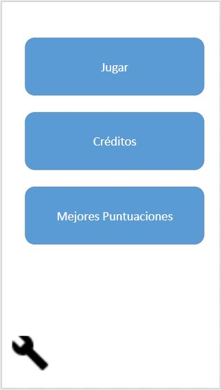
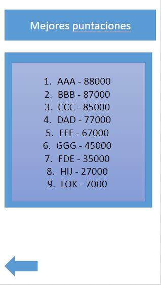
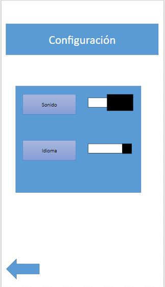
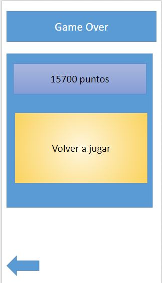
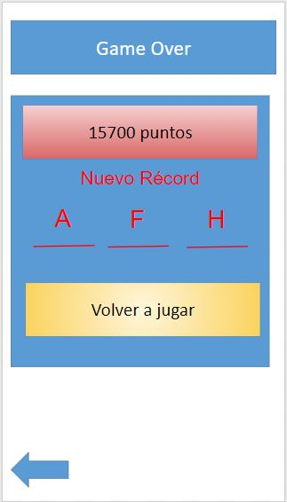

# Shoten Samurai - GDD
## Introducción
Se trata del documento de diseño de juego de *Shoten Samurai*, diseñado para navegadores web, tanto para ordenadores como dispositivos móviles. Este juego se diseñará exclusivamente con herramientas de W3C como HTML, CSS y JavaScript.
Se detallarán los conceptos claves del desarrollo del juego incluyendo mecánicas, arte, objetivos, controles, etc.
### Concepto del juego
*Shoten Samurai* es un juego en el que controlamos a un samurai que decide escalar una extraña torre que se está derrumbando, esquivando o destruyendo los objetos que van cayendo. 
### Características distintivas
* Un juego sencillo: un solo botón de acción para saltar.
* Una torre infinita, donde tendrás que aguantar lo máximo posible escalandola.
* Desafío constante, poniendo a prueba tus habilidades, aumentando la dificultad a medida que avanzas.
* Temática oriental con toques de humor.
### Género
La idea de *Shoten Samurai* nace de ideas como *Lumberjack*, *Geometry Dash* y *Fruit Ninja*, ideas simples y desafiantes, por lo tanto el juego es una mezcla de varios géneros como:
* **Endless Running**: La torre es infinita, escalando hasta donde aguantemos.
* **Arcade**: Cada vez más dificultad, aumentando la velocidad y más objetos por pantalla.
### Proṕosito y Público objetivo
Es un juego que está pensado para todos los públicos, tanto para gente con mucho tiempo libre y que busca un desafío que lo entretenga como personas con poco tiempo libre y buscan partidas cortas y pasar los ratos muertos en el metro, tren, colas, baño, etc.
### Jugabilidad
El juego se compondrá de un solo nivel infinito cuyo fondo y objetos en pantalla cambiarán según la dificultad. El personaje deberá saltar entre las dos paredes de la torre, destruyendo los objetos rompibles para conseguir más puntuación y esquivando aquellos obstáculos que le causarán una muerte terrible y dolorosa.
* **Movilidad**: Personaje que asciende por una torre, saltando de pared en pared con un ángulo de 45 grados.
*  **Obstáculos y objetos**: En las paredes habrá objetos fijos que habrá que esquivar y por el centro caerán objetos, algunos rompibles (bambú, tela, madera...) y otros indestructibles como (vigas de piedra, artefactos de joyas preciosas, etc.)
### Estilo visual
Con una estética oriental y con toques de pixel art, el juego será un reclamo para aficionados de este estilo visual y los nostálgicos de los 16 bits.
Los colores utilizados en el juego está basada en la paleta típica oriental feudal con tonos rojizos, dorados, marrones, incluso verdes.
### Alcance
El objetivo de este proyecto es presentar un juego con mecánicas sencillas, que sea fácil de entender y muy entretenido.
En un futuro se podrán incluir mejoras en las partidas o un apartado de personalización.
## Mecánicas del juego
En este apartado se explicará con detalle todo lo relacionado con las mecánicas del juego de Shoten Samurai.
De forma concisa y clara se mostrarán todos los aspectos importantes en cuanto las partidas, indicando cómo serán los niveles, cómo avanzará el personaje, qué objetos aparecerán por pantalla y demás.
### Jugabilidad
#### Niveles
Cada partida de Shoten Samurai se desarrollará en un único escenario infinito, donde la dificultad se irá incrementando en función de cuánto aguante el jugador. El background y algunos colores irán cambiando en cada zona y los objetos también sufrirán cambios visuales.
### Dificultad
Cuánto más aguantemos, más se incrementará la dificultad de la siguiente forma:
* Los objetos y los obstáculos de de las paredes caerán con más velocidad.
* Habrá más objetos por pantalla.
 
El jugador deberá prestar cada vez más atención y estimulando sus reflejos.
### Puntuación
Se podrán conseguir puntos de dos maneras
* El jugador obtendrá puntuación a medida que ascienda por la torre
* El jugador conseguirá puntos si rompe los objetos destruibles, aumentando la cantidad de puntos que consigue si los destruye de forma continua con cada salto, perdiendo el aumento de puntos si no se destruye algún objeto en el salto.

# ACABAR
Se guardará la mejor puntuación del jugador tras finalizar la partida, pudiendo introducir su nombre.
## Interfaz
 En esta sección se especificar ́a con detalle cada una de las pantallas que componen *Shoten Samurai*.
 Además, se indicarán las transiciones entre ellas así como la utilidad de cada elemento de la GUI (Graphical User Interface).
 Las imágenes adjuntas son bocetos muy basicos que ilustran los componentes que debe contener cada pantalla, no obstante, se planea hacer cambios en la apariencia y disposición y aspecto de los elementos.
### Diagrama de flujo
El siguiente diagrama de estados muestra las pantallas presentes a lo largo de *Shoten Samurai* así las transiciones entre ellas.
En puntos posteriores nos centraremos en ellas de forma individual.

*Figura 1: Diagrama de flujo de pantallas en el juego.*
### Menú Principal
A continuación el boceto de la pantalla de *Menú Principal*:

*Figura 2: Boceto del menú principal.*

Lista y descripción de todos sus componentes.
* **Botón Jugar**: Este botón te mostrara la cinematica de incio; la cual dara inicio a una nueva partida cuando acabe.
* **Botón Créditos**: Este botón te llevara a la pantalla de creditos.
* **Botón Mejores Puntuaciones**: Este botón te llevara a la pantalla de mejores puntuaciones.
* **Botón llave inglesa**: Este botón te llevara a la pantalla de configuración.
### Créditos
A continuación el boceto de la pantalla de *Créditos*:

*Figura 3: Boceto de la pantalla de créditos.*

Lista y descripción de todos sus componentes.
* **Botón Flecha**: Este botón te devolvera al menú principal.
### Mejores puntuaciones
A continuación el boceto de la pantalla de *Mejores puntuaciones*:

*Figura 4: Boceto de la pantalla de mejores puntuaciones.*

Lista y descripción de todos sus componentes.
* **Botón Flecha**: Este botón te devolvera al menú principal.
### Configuración
A continuación el boceto de la pantalla de *Configuración*:

*Figura 5: Boceto de la pantalla de configuración.*

Lista y descripción de todos sus componentes.
* **Checkbox**: Este checkbox te permitira activar/desactivar el sonido.
* **Desplegable**: Este desplegable te permitira escoger el idioma, los idiomas que se planean implementar son ingles, español y japones.
* **Botón Flecha**: Este botón te devolvera al menú principal.
### Pantalla principal
A continuación el boceto de la pantalla *principal*:

*Figura 6: Boceto de la pantalla principal.*

Esta pantalla sera la pantalla principal, donde el jugador pasara la mayor parte del tiempo, el funcionamiento de las mecanicas han sido explicadas anteriormente por lo que no seran repetidas.
### Game Over
A continuación el boceto de las variantes de la pantalla de *Game Over*:

*Figura 7: Boceto de la pantalla de Game Over.*

*Figura 8: Boceto de la pantalla de Game Over batiendo un nuevo record.*

Lista y descripción de todos sus componentes.
* **Name input**: El jugador usara este campo para intruducir sus iniciales; se mostraran como iniciales predeterminadas las últimas introducidas, se registrara al pulsar cualquiera de los botones.
* **Botón Volver a jugar**: Este botón dara directamente inicio a una nueva partida.
* **Botón Flecha**: Este botón te devolvera al menú principal.
## Arte
*Shoten Samurai* 

A continuación enumeramos los recursos necesarios:
### Arte 2D
Todas las imágenes deberán estar en formato *.png* o *.jpg* además de en el formato propio del programa con el que secrearon (*.psd* o *.xcf*) para posibles futuras modificaciones.
El fichero de trabajo debe tener una calidad superior a la requerida en el juego.

* **Interfaz**:
    * **Logo del Juego**: Logo del juego para poner en el menú principal
    * **Icono de configuración**: Icono que llevara a la pantalla de confuguración.
    * **Icono menú principal**: Icono que regrasara a la pantalla del menú principal
* **Personaje**:
    * **Samurai**: Deberá tener una animación de correr, salto, aterrizaje, corte y muerte.
    * **Obstaculo en pared**: Obstaculo en las paredes que obligaran a saltar al personaje. Se aconseja hacer varios modelos.
    * **Obstaculo cayendo**: Obstaculo cayendo por el escenario que dificultara el salto. Se aconseja hacer varios modelos.
    * **Objeto cortante Cayendo**: Objeto cayendo por el escenario que permitira sumar puntos. Debera haber una animacion de destruccion y se aconseja hacer varios modelos.
* **Escenario**:
    * **Fondo**: Fondo tildeable verticalmente, debera de haber al menos uno por cada nivel de dificultad.
### Animaciones 2D
Se dara libertad al artista para su implementación, aunque este debera de asegurarse que el formato escogido sea facilmente integrable en HTML5.
* **Animacion de incio**: Pequeña animacion cómica que dara inicio al juego.
### Sonido
Se dara libertad al artista para su implementación, aunque este debera de asegurarse que el formato escogido sea facilmente integrable en HTML5 y con los requisitos de espacio y rendemiento adecuados.
* **Menú principal**: música de aventura y tensión aunque más relajada que la correspondiente a los niveles. Por supuesto, debe invitar a comenzar una partida.
* **Juego**: Música animada e intensa que debe provocar en el jugador sensación de tensión y velocidad, se tratara que el ritmo aumente acorde con la velocidad.
* **Música Game Over**: Se contemplara un misterioso grito de *Shoten Samurai* que invite al jugador a jugar otra partida.
* **Sonido de corte**: Rápido sonido que sonara al cortar un objeto.
* **Sonido de salto**: Sonido realizado al saltar.
